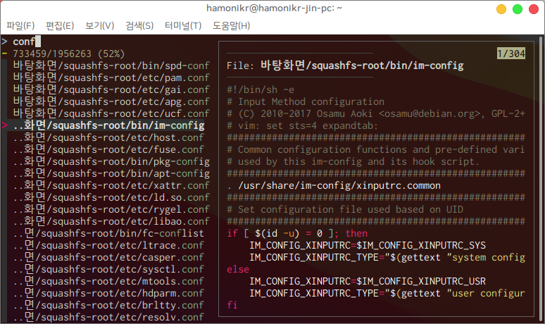

## hamonikr-ff

- 터미널에 사용자를 위한 파일의 내용을 보고 편집하는 프로그램
- 키보드의 방향키로 파일을 탐색하고 편집 가능
- 향상된 파일 검색 기능 제공

## 설치

이 프로그램은 하모니카 패키지 저장소에서 공급됩니다.
터미널에서 다음과 같이 명령어를 입력하면 설치가 완료됩니다.

```
curl -sL https://pkg.hamonikr.org/add-hamonikr.apt | sudo -E bash -

sudo apt install hamonikr-ff
```

## 프로그램 실행
터미널에서 ```ff``` 명령 실행
```
$ ff

또는

$ ff <디렉토리>
```

## 프로그램 주요기능

- F1 키 : 미리보기 화면의 파일 내용을 클립보드에 복사
- F2 또는 (Alt+v) 키 : 미리보기 화면의 파일을 수정
- Alt+p , Alt+n : 미리보기 창 상하 스크롤 이동
- ? : 미리보기 창 보이기, 숨기기 전환
- Alt+w : 미리보기 창 자동 줄 넘김 전환 (wrap)

## 이슈 또는 버그
 사용 중 문제를 발견하시면 root@hamonikr.org 또는 https://hamonikr.org 에서 알려주세요.
